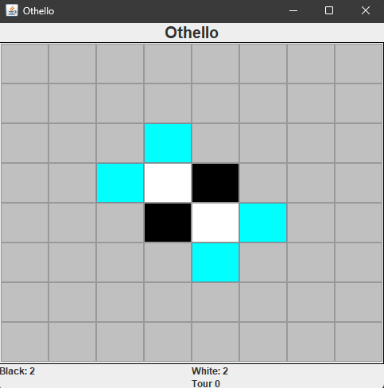

# OthelloAI

Une intelligence artificielle pour jouer au jeu **Othello / Reversi**, développée en Java. Il est possible de faire du Joueur contre IA en fonction de plusieurs stratégies (minimax, évaluation heuristique, etc.). Un mode Joueur contre Joueur est également disponible.

<p align="center">
  
</p>

---

## Fonctionnalités principales

| Fonction                             | Description                                                                |
| ------------------------------------ | -------------------------------------------------------------------------- |
| Interface console                    | Permet à un joueur humain d’affronter l’IA.                                |
| Algorithme Minimax                   | Implémentation du classique minimax avec profondeur variable.              |
| Élagage alpha‑beta                   | Améliore l’efficacité en supprimant les branches inutiles.                 |
| Fonction d’évaluation heuristique    | Basée sur la position, les coins, la mobilité, etc.                        |

---

## Installation rapide

*Exemple avec JDK 17+ :*

```bash
# 1) Cloner le repo
$ git clone https://github.com/Fir3n0x/OthelloAI.git
$ cd OthelloAI

# 2) Compiler les fichiers Java
$ javac src/*.java

# 3) Lancer la partie
$ java src/OthelloGUI
ou
$ java src/OthelloPVP
```

---

## Utilisation

Le programme propose le mode :

* Humain vs IA

Exemple d’affichage console :

```
Tour 4 – Joueur Noir (IA)
Score: Blanc 12 | Noir 14

  0 1 2 3 4 5 6 7
0 . . . . . . . .
1 . . . . . . . .
2 . . . . . . . .
3 . . . B N . . .
4 . . . N B . . .
5 . . . . . . . .
6 . . . . . . . .
7 . . . . . . . .

Coup joué: (4,5)
```

<p float="left">
  
</p>

## Contribuer

1. Fork le dépôt
2. Crée une branche (`git checkout -b feat/nouvelle‑feature`)
3. Commits (`git commit -am 'Ajout : feature'`)
4. Push (`git push origin feat/nouvelle‑feature`)
5. Ouvre une Pull Request

Merci de respecter la structure du code existant et de tester toute nouvelle fonctionnalité avant de proposer une PR.

---

## ℹ️ Remarques

Ce projet est un exercice personnel visant à expérimenter des algorithmes d’IA sur un jeu stratégique bien défini. Il peut être utilisé à des fins pédagogiques ou de benchmark.

---

## 🌐 English TL;DR

Java Othello AI using minimax + alpha‑beta pruning. CLI interface. Play against AI or watch AI vs AI. To run:

```bash
javac src/*.java
java src/OthelloGUI
or
java src/OthelloPVP
```

Heuristic and depth are customizable.
